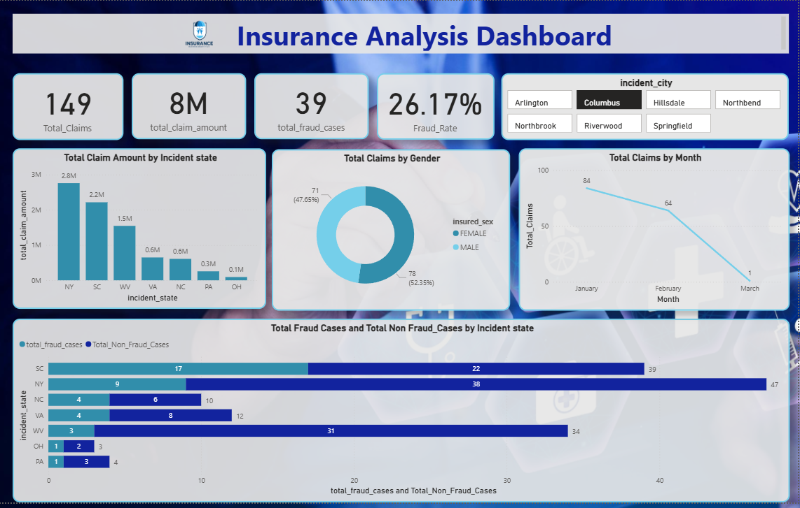
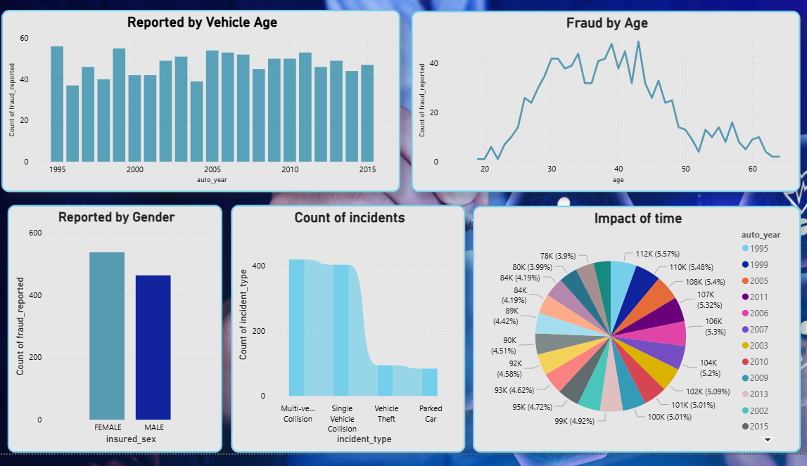

# 🚀 Insurance Analysis Dashboard (Power BI)


---

## 📌 Project Overview  
The **Insurance Analysis Dashboard** is an interactive Power BI project designed to analyze insurance claims, fraud cases, and customer behavior. It provides actionable insights into claim distribution, fraud detection, and risk patterns to support data-driven decision-making.

---

## 🎯 Objectives  
- Analyze **insurance claims and fraud trends**  
- Identify **high-risk factors and fraud patterns**  
- Understand **customer demographics and behavior**  
- Enable **data-driven decision-making**  

---

## 📊 Key Insights  

- 📌 **Total Claims:** 149  
- 💰 **Total Claim Amount:** 8M  
- ⚠️ **Fraud Cases:** 39  
- 📉 **Fraud Rate:** 26.17%  

### 🔍 Insights  

- Higher claim amounts in **NY and SC**  
- Fraud more common in **age group 30–45**  
- **Male customers** slightly higher claims  
- Most incidents: **Multi-vehicle collisions**  
- Claims show **declining trend (Jan → Mar)**  
- **Columbus city** has high claim activity  

---

## 📈 Dashboard Features  

- Interactive **KPIs Dashboard**  
- **State-wise & City-wise Analysis**  
- **Gender-based Insights**  
- **Monthly Trend Analysis**  
- **Incident Type Breakdown**  
- Filters & slicers for **dynamic analysis**  

---

## 🛠️ Tools & Technologies  

- **Power BI**  
- **Power Query**  
- **DAX**  

---

## 📸 Dashboard Preview  

### 🏠 Home Page  


### 📊 Main Dashboard  



---

## 📂 Project Structure  

```
Insurance-Analysis-Dashboard/
│── Insurance Analysis.pbix
│── README.md
│── images/
    │── home.png
    │── dashboard.png
```

---

## 🚀 Skills Demonstrated  

- Data Analysis & Visualization  
- Exploratory Data Analysis (EDA)  
- KPI Design  
- Data Cleaning & Transformation  
- Dashboard Storytelling  

---

## 🔗 Project Link  

👉 https://github.com/Mamta-18/PowerBI-Projects  

---

## 💡 Conclusion  

This dashboard helps in understanding **fraud patterns, claim distribution, and customer behavior**, enabling better **risk management and business decisions**.
