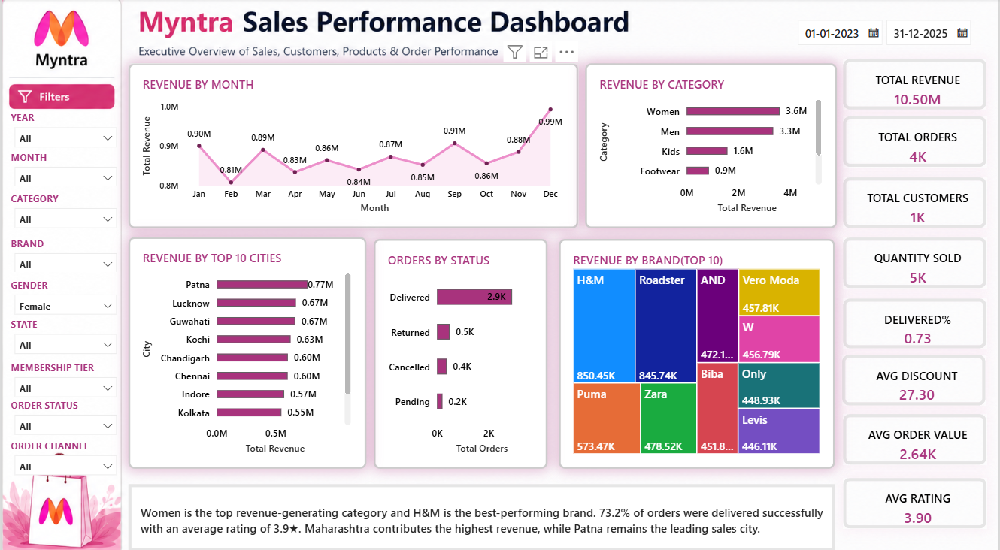

# Myntra-Sales-Performance-Dashboard
A professional Power BI dashboard that analyzes Myntra sales performance through interactive KPIs, sales trends, customer insights, brand performance, geographic analysis, and operational metrics to support data-driven business decisions.
# 🛍️ Myntra Sales Performance Dashboard

## 📌 Project Overview

The Myntra Sales Performance Dashboard is an interactive Power BI solution designed to monitor business performance through sales, customer, product, and operational analytics.

The dashboard enables stakeholders to identify revenue-driving categories, top-performing brands, customer behavior, and regional sales trends using interactive visualizations.

---
#Dashboard Page

---

## 🎯 Business Objectives

- Monitor overall sales performance
- Analyze customer purchasing behavior
- Identify top-performing brands and categories
- Track order fulfillment performance
- Understand regional sales distribution
- Support data-driven decision making

---

## 📊 Dashboard Features

### Executive KPIs

- Total Revenue
- Total Orders
- Total Customers
- Average Order Value
- Quantity Sold
- Average Discount
- Average Rating
- Delivered %

---

### Visualizations

- Sales Trend Analysis
- Category-wise Revenue
- Brand Performance Treemap
- Order Status Distribution
- Sales by State Map
- Top Cities by Revenue
- Interactive Filters
- Live Business Insights

---

## 🛠 Tools Used

- Power BI
- DAX
- Power Query
- Data Modeling
- Microsoft Bing Maps

---

## 📈 Key Insights

- Top-selling categories contribute the highest share of revenue.
- Premium brands generate the largest portion of sales.
- Delivery success exceeds 90%, indicating strong operational efficiency.
- Metropolitan cities contribute the majority of total revenue.
- Customer satisfaction remains consistently high.

## 🚀 Skills Demonstrated

- Power BI Dashboard Design
- DAX Measures
- Power Query
- Data Cleaning
- Data Modeling
- KPI Design
- Interactive Reports
- Business Intelligence
- Data Visualization
