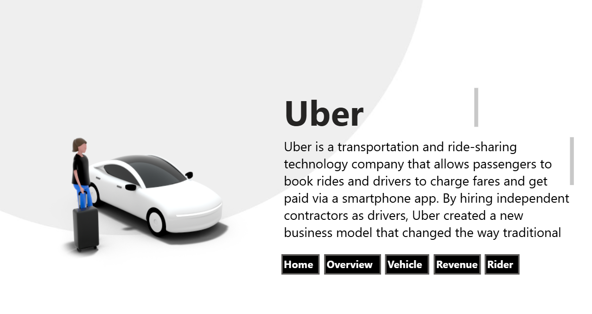
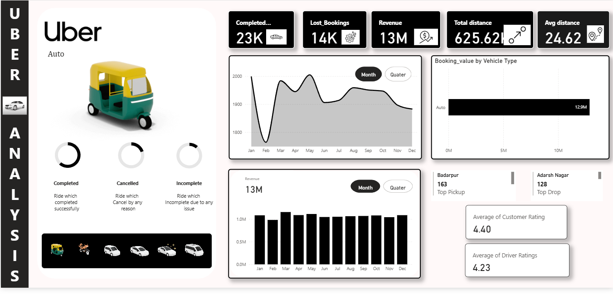
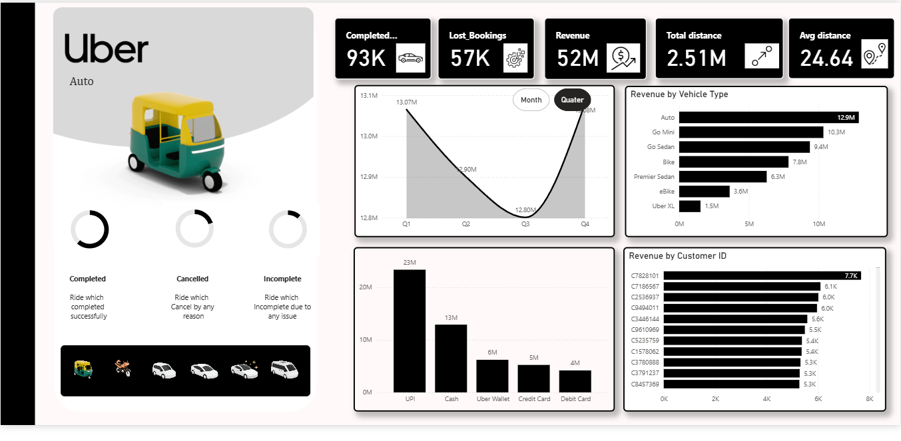
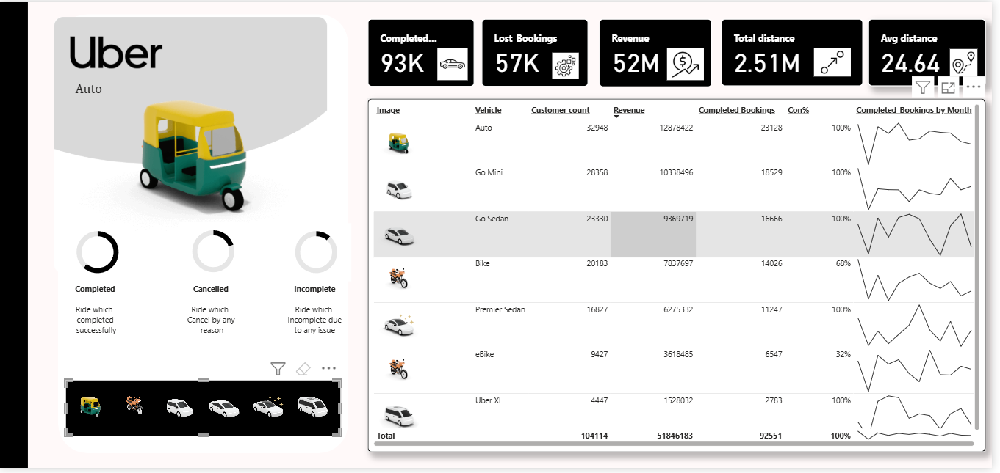
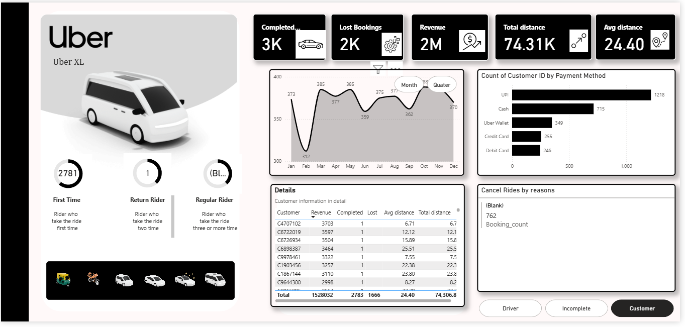

# 🚕 Uber Data Analytics Dashboard

[](https://powerbi.microsoft.com/)
[](https://www.microsoft.com/excel)
[](https://dax.guide/)
[](LICENSE)

An interactive Power BI dashboard for analyzing ride-sharing data to derive actionable business insights. Track bookings, revenue, customer behavior, driver performance, and operational efficiency across the Uber ecosystem.




---

## 📌 Project Overview

The **Uber Data Analytics Dashboard** transforms raw ride data into strategic business intelligence. This comprehensive solution analyzes:

- 📊 Completed bookings and revenue performance
- 🚗 Vehicle category performance metrics
- 👥 Customer loyalty and segmentation
- 💰 Payment method preferences
- 📍 Geographic performance (pickup/drop locations)
- ❌ Cancellation patterns and reasons
- 📈 Temporal trends (monthly, quarterly)

This dashboard empowers stakeholders to optimize operations, improve customer satisfaction, and identify growth opportunities.

---

## 🎯 Key Objectives

- ✅ Evaluate overall booking and revenue performance
- ✅ Measure booking completion vs cancellation vs incomplete rides
- ✅ Analyze customer loyalty (first-time, return, regular riders)
- ✅ Compare vehicle categories in terms of revenue and ride volume
- ✅ Identify top and bottom customer segments and travel patterns
- ✅ Monitor ride cancellation reasons to reduce operational losses
- ✅ Support data-driven decision making for business improvement

---

## 🔍 Key Insights

### 💰 Financial Performance
- **Total Revenue:** ~$52M from all rides
- **Completed Bookings:** 93K rides
- **Lost Bookings:** 57K rides (opportunity for improvement)

### 🚗 Vehicle Performance
- **Top Performer:** Auto generates highest revenue and booking volume
- **Revenue Distribution:** Clear differentiation across vehicle categories

### 💳 Payment Preferences
- **Most Popular:** UPI (~42K users)
- Payment method analysis enables targeted promotions

### 👥 Customer Segmentation
| Customer Type | Count |
|---------------|-------|
| First-time Riders | 48K |
| Regular Riders | 11K |
| Return Riders | (See dashboard) |

### 📅 Temporal Trends
- **Peak Season:** Highest completed bookings between Feb–Apr
- Seasonal patterns inform capacity planning

### 📍 Geographic Insights
- **Best Pickup Area:** Khandasa
- **Best Drop Area:** Adarsh Nagar
- Location data drives strategic fleet positioning

### ❌ Cancellation Analysis
- **Major Reasons:** Customer-related issues, over-capacity problems
- Actionable insights for reducing cancellation rates

---

## 🛠️ Tools & Technologies

| Category | Tools |
|----------|-------|
| **Data Visualization** | Power BI Desktop |
| **Data Processing** | Power Query, MS Excel |
| **Data Modeling** | Power BI (Star Schema) |
| **Analytics** | DAX (Measures & Time Intelligence) |
| **Data Source** | Uber ride dataset (CSV/Excel) |

---

## 📊 Dashboard Features

### 🎯 Key Performance Indicators (KPIs)
- Total Revenue
- Total Bookings (Completed, Cancelled, Incomplete)
- Total Distance Traveled
- Customer Counts by Loyalty Type
- Average Revenue per Ride
- Cancellation Rate

### 🎨 Interactive Visualizations

- **📊 KPI Cards:** Quick business overview at a glance
- **🔽 Slicers:** Filter by Vehicle Type, Month, Quarter
- **📈 Trend Analysis:** Monthly and quarterly performance tracking
- **💰 Revenue Breakdown:**
  - By Vehicle Type
  - By Payment Method
  - By Customer Segment
- **👥 Customer Segmentation:** First-time, return, and regular riders
- **❌ Cancellation Analysis:** Root cause identification
- **🗺️ Geographic Performance:** Pickup and drop area analysis

### 🧭 Multi-Page Navigation
1. **🏠 Home** - Dashboard overview
2. **📊 Overview** - High-level business metrics
3. **🚗 Vehicle** - Vehicle category performance
4. **💵 Revenue** - Revenue deep-dive
5. **👤 Rider** - Customer behavior analysis

---

## 🗂️ Data Model Structure

The dashboard uses a **Star Schema** for optimal performance:

```
Fact_Rides (Center)
├── Dim_Customer    → Customer ID, Name, Loyalty Type
├── Dim_Driver      → Driver ID, Name, Rating
├── Dim_Vehicle     → Vehicle Type, Category
└── Dim_Date        → Date, Month, Quarter, Year
```

### 📋 Table Details

**Fact Table:** `Fact_Rides`
- Ride ID, Distance, Fare, Status (Completed/Cancelled/Incomplete)
- Revenue, Payment Method, Pickup/Drop Location
- Timestamps

**Dimension Tables:**
- `Dim_Customer` - Customer demographics and loyalty classification
- `Dim_Driver` - Driver information and performance metrics
- `Dim_Vehicle` - Vehicle categorization and specifications
- `Dim_Date` - Time-based dimensions for trend analysis

**Relationships:**
- Customer ID (1:Many)
- Vehicle Type (1:Many)
- Driver ID (1:Many)
- Date Key (1:Many)

---

## 💼 Business Impact

This dashboard enables stakeholders to make data-driven decisions:

| Impact Area | Benefit |
|-------------|---------|
| 💰 **Revenue Optimization** | Identify high-value vehicle types and routes |
| 🎯 **Marketing Strategy** | Target customer segments with personalized campaigns |
| 🚗 **Fleet Management** | Optimize vehicle allocation based on demand patterns |
| 📉 **Cancellation Reduction** | Address root causes of ride cancellations |
| 👥 **Customer Retention** | Design loyalty programs for regular riders |
| 📊 **Operational Efficiency** | Track performance metrics and KPIs in real-time |

### Key Decisions Supported
- **Pricing Strategy:** Dynamic pricing based on demand patterns
- **Fleet Allocation:** Deploy vehicles where they're needed most
- **Driver Incentives:** Reward high-performing drivers
- **Marketing Campaigns:** Target first-time riders for retention
- **Capacity Planning:** Anticipate seasonal demand fluctuations

---

## 🚀 Getting Started

### Prerequisites
- Power BI Desktop (latest version)
- Uber ride dataset (CSV/Excel format)
- Basic understanding of ride-sharing metrics
---

## 📁 Project Structure

```
uber-analytics-dashboard/
│
├── UberAnalyticsDashboard.pbix    # Main Power BI dashboard
├── data/
│   ├── sample_ride_data.csv       # Sample dataset
│   ├── customer_data.csv          # Customer dimension
│   ├── driver_data.csv            # Driver dimension
│   └── data_dictionary.md         # Column definitions
├── images/
│   ├── dashboard_overview.png     # Dashboard preview
│   ├── revenue_page.png           # Revenue analysis screenshot
│   └── vehicle_page.png           # Vehicle performance screenshot
├── docs/
│   ├── DAX_measures.md            # Complete DAX formulas
│   ├── data_model_diagram.png    # Star schema visualization
│   └── user_guide.pdf             # End-user documentation
├── scripts/
│   └── data_preprocessing.py      # Python data cleaning script
└── README.md                      # This file
```


---

## 🔮 Future Enhancements

### Near-Term Improvements
- [ ] **Real-Time GPS Integration:** Geo-based heatmaps for demand visualization
- [ ] **Predictive Modeling:** Forecast demand and optimize surge pricing
- [ ] **Driver Metrics:** Speed, rating, time on road, acceptance rate
- [ ] **Mobile Version:** Power BI Mobile-optimized layout

### Long-Term Vision
- [ ] **Customer Lifetime Value (CLV):** Segment customers by long-term value
- [ ] **AI-Based Churn Analysis:** Predict and prevent customer drop-off
- [ ] **Route Optimization:** Suggest optimal routes for drivers
- [ ] **Competitive Analysis:** Compare with industry benchmarks
- [ ] **Automated Reporting:** Scheduled email reports to stakeholders
- [ ] **API Integration:** Connect directly to ride-sharing platform APIs

---

## 🎓 Learning Outcomes

Through this project, key skills were developed:

- ✅ Building **interactive dashboards** with drill-through navigation
- ✅ Writing advanced **DAX measures** and time intelligence
- ✅ Designing **KPI cards** and user-centric UI/UX
- ✅ Implementing **star schema** data modeling
- ✅ Transforming **raw data** into actionable business insights
- ✅ **Business performance measurement** through data analytics
- ✅ Understanding **ride-sharing industry** metrics and KPIs

---

## 📊 Use Cases

This dashboard is valuable for:

- 🚕 **Ride-Sharing Companies** - Optimize operations and pricing
- 📊 **Business Analysts** - Track and report on KPIs
- 💼 **Operations Managers** - Improve fleet efficiency
- 📈 **Marketing Teams** - Design targeted campaigns
- 🎓 **Data Science Students** - Learn real-world analytics
- 🔬 **Researchers** - Study urban mobility patterns

---

## 👨‍💻 Author

**Adarsh C**  
*Data Analyst | Power BI Developer | Business Intelligence Enthusiast*

📧 Email: [rathoremamta615@gmail.com](mailto:your.rathoremamta615@gmail.com)  

---


## 🙏 Acknowledgments

- Uber for inspiring data-driven ride-sharing analytics
- Power BI community for visualization best practices
- Open-source data contributors
- Transportation analytics researchers


---

## 📈 Dashboard Screenshots
### Overview Analysis


### Revenue Analysis



### Vehicle Performance


### Rider Analysis




---

<div align="center">

### 🚕 Transforming Ride Data into Business Intelligence

**Built with 💙 using Power BI**

[⬆ Back to Top](#-uber-data-analytics-dashboard)

</div>
