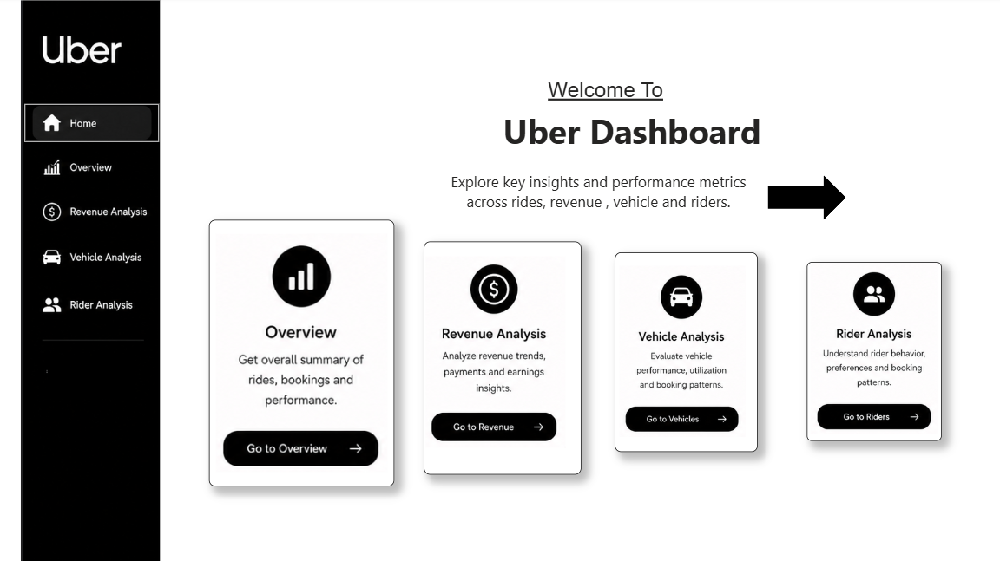
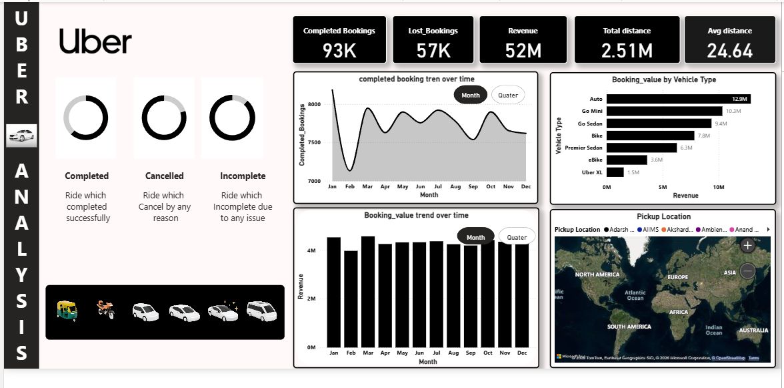
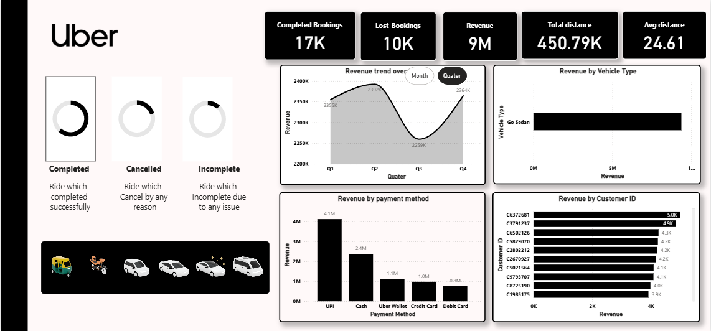
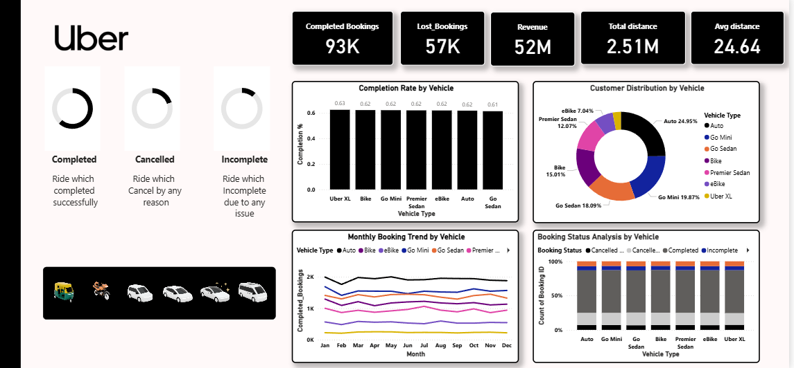

# Uber Analysis Dashboard 🚖📊

An interactive **Power BI dashboard project** developed to analyze Uber ride booking data, customer behavior, vehicle performance, revenue trends, and operational insights. This dashboard transforms raw ride-booking data into meaningful business intelligence using modern visualizations and data storytelling techniques.

---

# 📌 Project Overview

The **Uber Analysis Dashboard** provides a complete analysis of:
- Ride bookings
- Revenue generation
- Vehicle performance
- Rider/customer behavior
- Payment preferences
- Cancellation analysis
- Booking trends

The dashboard is divided into multiple analytical pages for better business understanding and decision-making.

---

# 🎯 Objectives

- Analyze Uber booking operations
- Monitor revenue and booking trends
- Evaluate vehicle-wise performance
- Understand rider/customer behavior
- Identify cancellation reasons
- Build an interactive and professional BI dashboard

---

# 🛠 Tools & Technologies Used

- Power BI
- Power Query
- DAX (Data Analysis Expressions)
- Data Modeling
- Interactive Visualizations

---

# 📂 Dashboard Pages

---

# 🏠 Home Page

The Home Page acts as the navigation interface for the dashboard. It provides easy access to all analytical pages using interactive navigation buttons.

### Features
- Interactive page navigation
- Clean dashboard landing page
- User-friendly UI design

## 📷 Home Page Screenshot

---

# 📈 Overview Dashboard

The Overview Dashboard provides a complete business summary including:
- Completed bookings
- Lost bookings
- Revenue analysis
- Distance analysis
- Vehicle-wise booking insights
- Monthly booking trends

### Key Insights
- Revenue trends over time
- Vehicle booking comparison
- Customer and driver rating analysis
- Operational overview of Uber bookings

## 📷 Overview Dashboard Screenshot

---

# 💰 Revenue Analysis Dashboard

The Revenue Dashboard focuses on financial analysis by evaluating:
- Revenue by vehicle type
- Payment method contribution
- Revenue trends
- Customer revenue patterns

### Key Insights
- Most profitable vehicle category
- Revenue contribution by payment method
- Financial performance trends

## 📷 Revenue Dashboard Screenshot

---

# 🚗 Vehicle Analysis Dashboard

The Vehicle Analysis Dashboard evaluates vehicle operational performance using:
- Vehicle-wise booking analysis
- Customer distribution by vehicle
- Monthly booking trends
- Booking status analysis

### Key Insights
- High-performing vehicle categories
- Vehicle utilization patterns
- Operational efficiency analysis
- Vehicle booking trends

## 📷 Vehicle Dashboard Screenshot

---

# 👥 Rider Analysis Dashboard

The Rider Analysis Dashboard focuses on customer behavior and rider insights:
- Rider segmentation
- Customer trends
- Payment behavior
- Cancellation analysis
- Completed vs cancelled rides by payment method

### Key Insights
- UPI is the most preferred payment method
- Customer demand fluctuates monthly
- Cancellation analysis identifies operational issues
- Customer behavior trends across booking patterns

## 📷 Rider Dashboard Screenshot

---

# 📊 Features

✅ Interactive Filters & Slicers  
✅ Vehicle Image Slicers  
✅ Dynamic KPI Cards  
✅ Trend Analysis  
✅ Customer Behavior Analysis  
✅ Revenue Analysis  
✅ Operational Insights  
✅ Interactive Navigation Buttons  
✅ Clean & Modern Dashboard Design  

---

# 📌 Business Insights

- Auto category generated higher revenue and bookings.
- UPI was the most preferred payment method.
- Monthly customer demand fluctuated across the year.
- Cancellation analysis helped identify operational inefficiencies.
- Vehicle-wise analysis helped identify high-performing categories.

---

# 🚀 Future Improvements

- Real-time data integration
- Predictive analytics using Machine Learning
- Geo-location ride analysis
- Driver performance analytics
- Customer retention prediction

---

# 📁 Dataset Information

The dataset contains:
- Booking details
- Vehicle categories
- Customer IDs
- Payment methods
- Ride distances
- Booking status
- Revenue-related information

---

# 👨‍💻 Author

## Mamta Rathore

---

# 📌 Conclusion

This project demonstrates how raw Uber ride-booking data can be transformed into meaningful business insights using Power BI dashboards, helping improve operational efficiency, customer analysis, and business decision-making.

This project demonstrates how raw Uber ride-booking data can be transformed into meaningful business insights using Power BI dashboards, helping improve operational efficiency, customer analysis, and business decision-making.
